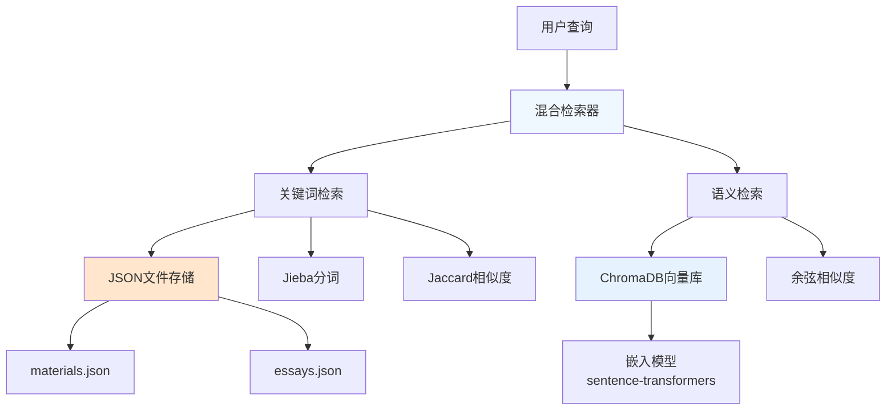
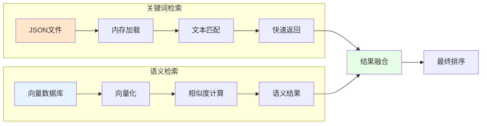
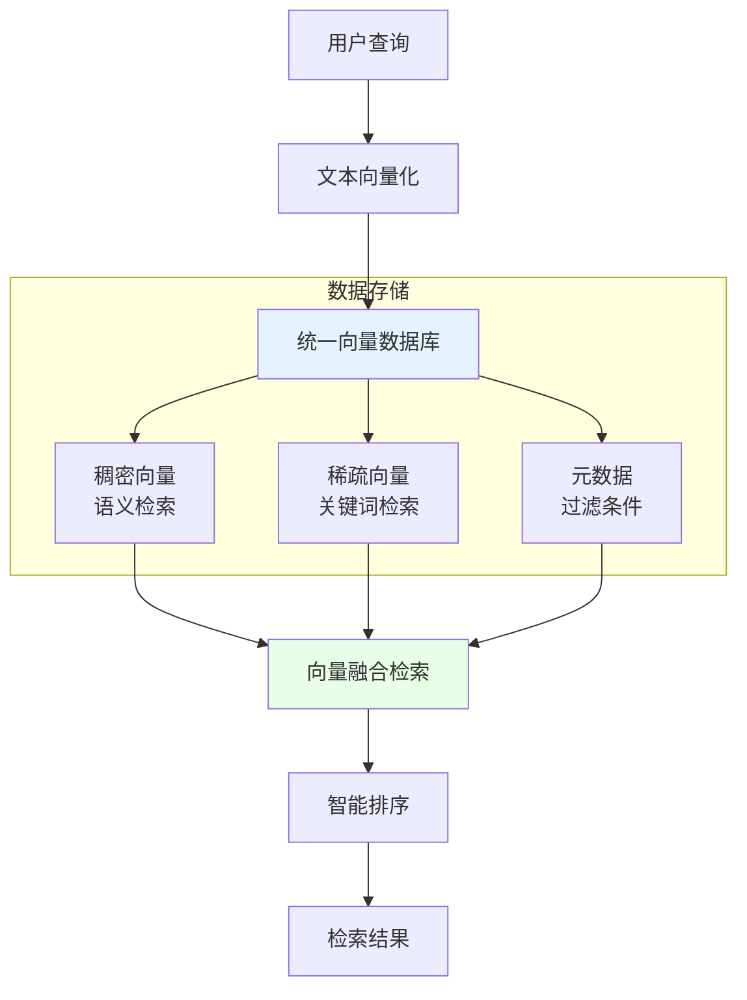
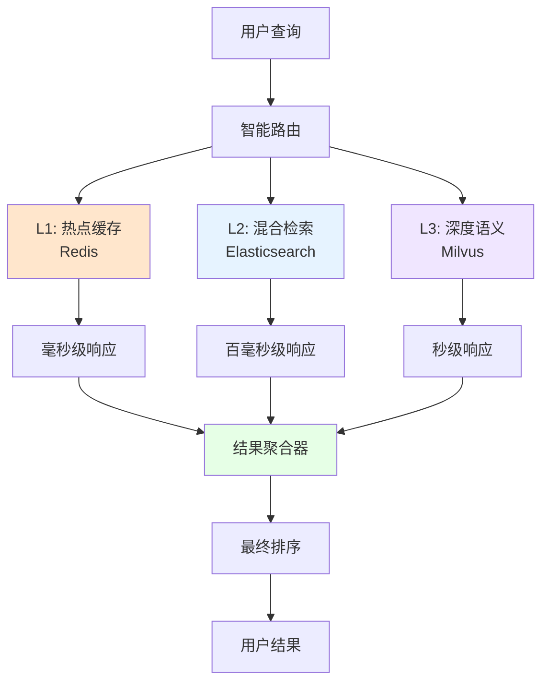

# RAG系统检索方案技术分析

## 当前实现架构



## 技术方案对比

### 方案一：当前混合方案


**优势：**
- ✅ 实现简单，开发成本低
- ✅ 关键词检索响应快（<10ms）
- ✅ 语义检索效果好
- ✅ 资源占用适中

**劣势：**
- ❌ 双重维护成本
- ❌ 数据一致性挑战
- ❌ 扩展性有限

**适用规模：** 1万-10万条素材

### 方案二：全向量化方案


**技术栈选择：**

#### Elasticsearch + dense_vector
```json
{
  "mappings": {
    "properties": {
      "title": {"type": "text", "analyzer": "ik_max_word"},
      "content": {"type": "text", "analyzer": "ik_max_word"},
      "keywords": {"type": "keyword"},
      "embedding": {"type": "dense_vector", "dims": 768},
      "category": {"type": "keyword"},
      "difficulty": {"type": "integer"}
    }
  }
}
```

#### Pinecone 配置
```python
import pinecone

# 初始化
pinecone.init(
    api_key="your-api-key",
    environment="us-west1-gcp"
)

# 创建索引
index = pinecone.Index("essay-materials")

# 混合检索
results = index.query(
    vector=query_embedding,
    filter={"category": "narrative", "difficulty": {"$gte": 2}},
    top_k=10,
    include_metadata=True
)
```

**优势：**
- ✅ 统一管理，维护成本低
- ✅ 扩展性强，可处理百万级数据
- ✅ 支持复杂过滤条件
- ✅ 语义理解能力强

**劣势：**
- ❌ 初期开发成本高
- ❌ 需要更多计算资源
- ❌ 冷启动问题

**适用规模：** 10万-1000万条素材

### 方案三：分层检索方案


**分层策略：**
```python
class LayeredRetriever:
    def search(self, query: str, user_context: dict):
        # L1: 缓存层检索
        cache_results = self.redis_cache.get(query_hash)
        if cache_results and self.is_fresh(cache_results):
            return cache_results

        # L2: 混合检索
        es_results = self.elasticsearch.search(query, filters=user_context)
        if len(es_results) >= threshold:
            self.cache_results(query_hash, es_results)
            return es_results

        # L3: 深度语义检索
        vector_results = self.milvus.search(
            query_embedding,
            similarity_threshold=0.7
        )

        # 结果融合
        final_results = self.merge_and_rank(es_results, vector_results)
        self.cache_results(query_hash, final_results)
        return final_results
```

**优势：**
- ✅ 极高的性能和可扩展性
- ✅ 智能资源分配
- ✅ 支持个性化检索
- ✅ 容错能力强

**劣势：**
- ❌ 架构复杂，运维成本高
- ❌ 开发周期长
- ❌ 需要大量基础设施

**适用规模：** 千万级以上素材库

## 生产环境推荐方案

### 小型系统（<10万素材）
**推荐：当前方案优化版**
```python
# 优化关键词检索
class OptimizedKeywordSearch:
    def __init__(self):
        self.inverted_index = {}  # 倒排索引
        self.material_cache = {}  # 内存缓存

    def build_index(self, materials):
        """构建倒排索引"""
        for material in materials:
            words = jieba.cut(material.content)
            for word in words:
                if word not in self.inverted_index:
                    self.inverted_index[word] = []
                self.inverted_index[word].append(material.id)

    def search(self, query, top_k=10):
        """基于倒排索引的快速检索"""
        query_words = jieba.cut(query)
        candidates = set()

        for word in query_words:
            if word in self.inverted_index:
                candidates.update(self.inverted_index[word])

        # 计算相关性分数并排序
        return self.rank_candidates(candidates, query, top_k)
```

### 中型系统（10万-100万素材）
**推荐：Elasticsearch + 向量检索**
```yaml
# docker-compose.yml
version: '3.8'
services:
  elasticsearch:
    image: docker.elastic.co/elasticsearch/elasticsearch:8.10.0
    environment:
      - discovery.type=single-node
      - xpack.security.enabled=false
    ports:
      - "9200:9200"

  milvus:
    image: milvusdb/milvus:v2.3.0
    ports:
      - "19530:19530"
    environment:
      ETCD_ENDPOINTS: etcd:2379
      MINIO_ADDRESS: minio:9000
```

### 大型系统（>100万素材）
**推荐：云原生方案**
```python
# 使用 Pinecone + Redis + PostgreSQL
class ProductionRAGSystem:
    def __init__(self):
        self.pinecone_index = pinecone.Index("essay-rag")
        self.redis_client = redis.Redis(host='redis-cluster')
        self.pg_pool = asyncpg.create_pool('postgresql://...')

    async def hybrid_search(self, query: str, user_id: str):
        # 个性化检索
        user_profile = await self.get_user_profile(user_id)

        # 多路并发检索
        tasks = [
            self.cache_search(query),
            self.vector_search(query, user_profile),
            self.metadata_filter(user_profile)
        ]

        results = await asyncio.gather(*tasks)
        return self.intelligent_merge(results, user_profile)
```

## 性能对比分析

| 方案 | 检索延迟 | 存储成本 | 开发复杂度 | 扩展性 | 语义理解 |
|------|----------|----------|------------|--------|----------|
| 当前混合 | 50-200ms | 低 | 低 | 中 | 中 |
| 全向量化 | 100-500ms | 中 | 中 | 高 | 高 |
| 分层检索 | 10-100ms | 高 | 高 | 极高 | 极高 |

## 迁移建议

### 阶段一：优化当前方案
1. 为JSON文件添加倒排索引
2. 增加Redis缓存层
3. 优化向量化流程

### 阶段二：引入Elasticsearch
1. 迁移关键词检索到ES
2. 保留ChromaDB做语义检索
3. 实现智能路由

### 阶段三：云原生升级
1. 迁移到Pinecone/Weaviate
2. 增加个性化推荐
3. 实现实时学习优化

总结来说，**关键词检索不是从向量数据库查询的**，而是直接从JSON文件中基于文本相似度计算的传统检索方式。这种设计在中小规模下是合理的，但随着数据量增长，建议逐步向统一的向量化方案迁移。
