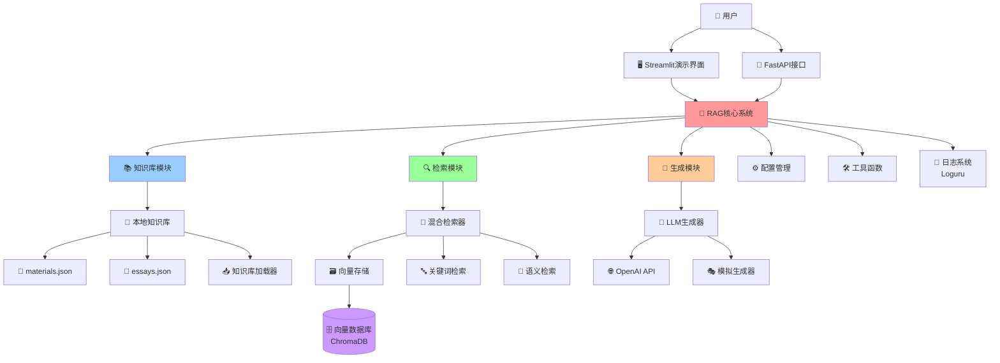
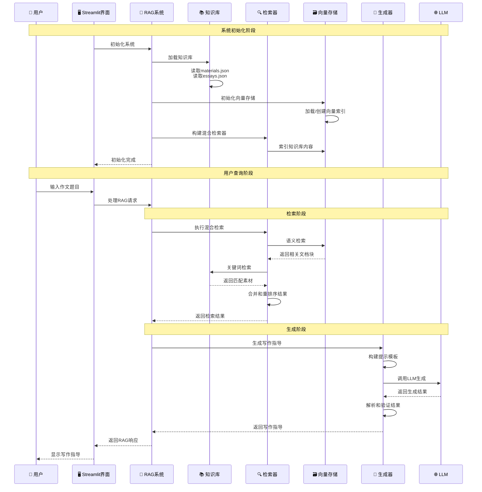
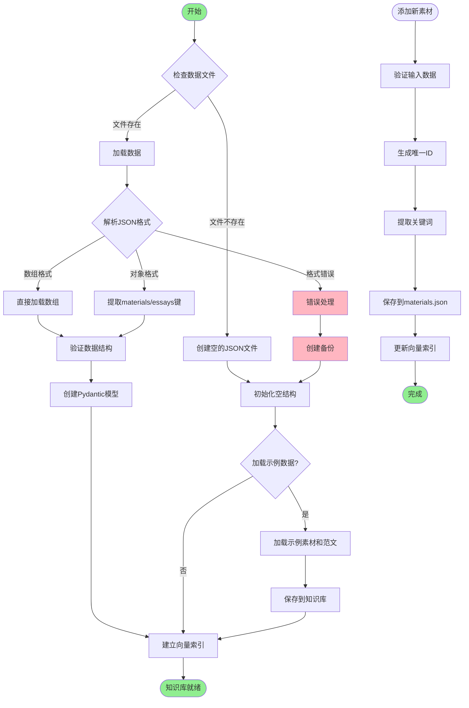
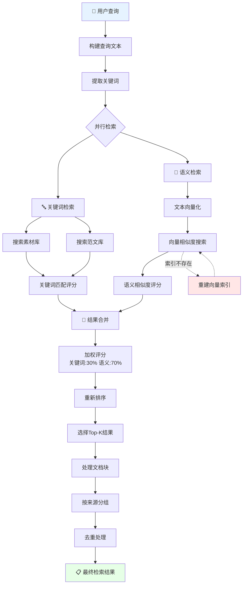
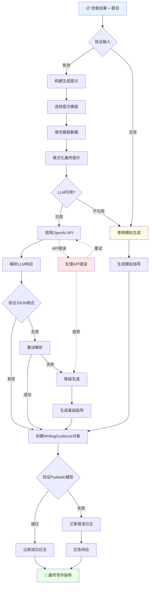
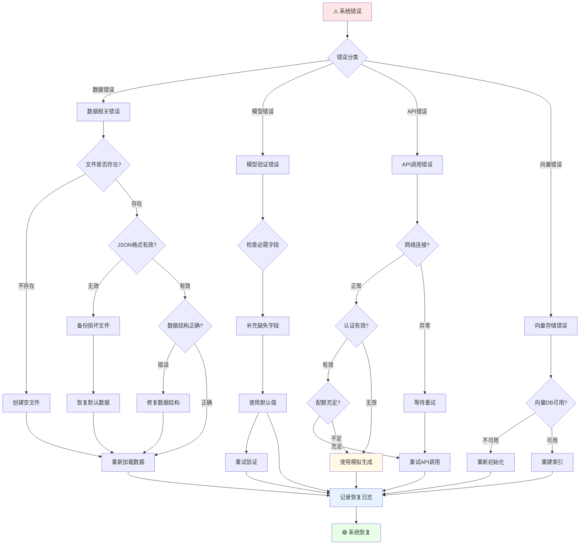
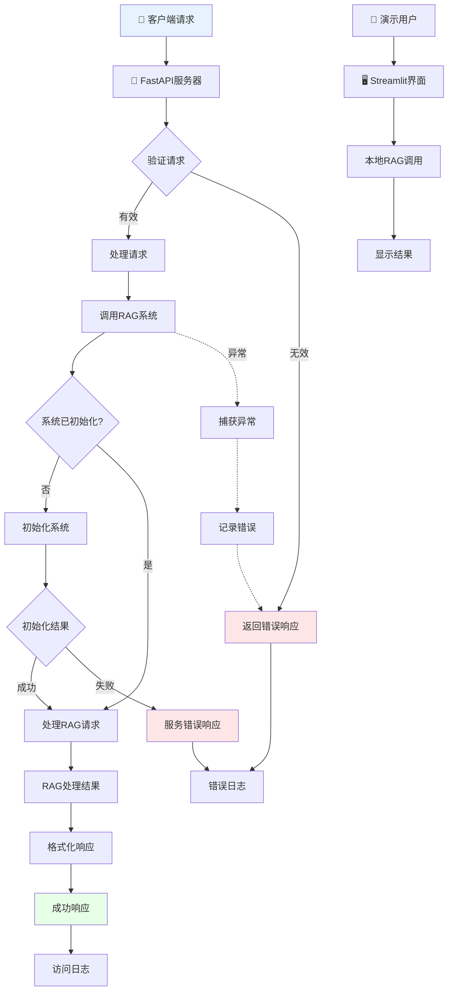
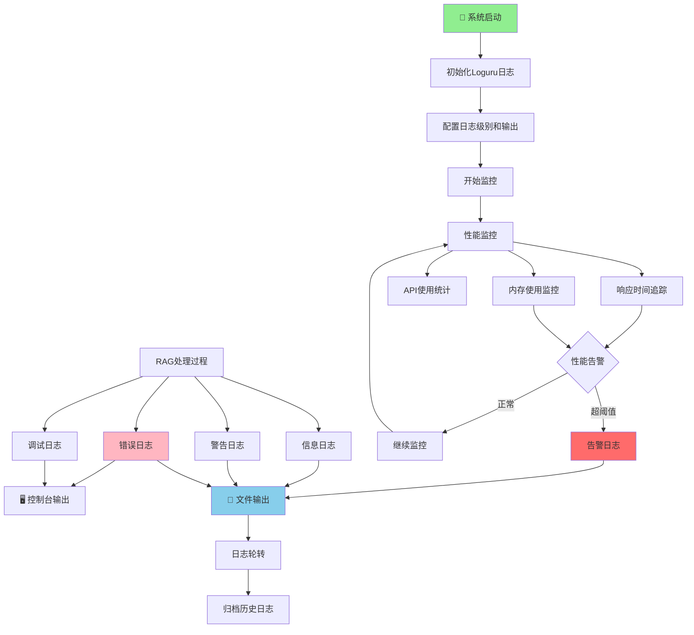

# RAG作文教学系统详细流程图

## 系统总体架构流程图

## 详细数据流程图

## 知识库管理流程图

## 检索系统详细流程图

## 生成系统详细流程图

## 错误处理和恢复流程图

## API服务流程图

## 系统监控和日志流程图

---

## 系统特性说明

### 1. 模块化设计

- **知识库模块**: 支持本地JSON文件存储，具备数据验证和错误恢复
- **检索模块**: 混合检索策略，结合关键词和语义检索
- **生成模块**: 支持LLM和模拟生成的双重策略
- **配置模块**: 集中式配置管理，支持环境变量

### 2. 错误处理机制

- **分层错误处理**: 在数据、模型、API、向量存储各层实现错误捕获
- **自动恢复**: 支持数据损坏修复、网络重试、索引重建
- **降级策略**: LLM不可用时自动切换到模拟生成

### 3. 数据兼容性

- **多格式支持**: 兼容数组和对象格式的JSON数据
- **版本兼容**: 支持数据结构的向前兼容
- **动态类型处理**: 使用Pydantic进行数据验证和转换

### 4. 性能优化

- **并行检索**: 关键词和语义检索并行执行
- **缓存机制**: 向量索引缓存，减少重复计算
- **懒加载**: 按需加载数据和模型

### 5. 可观测性

- **详细日志**: 使用Loguru记录系统运行状态
- **性能监控**: 追踪响应时间、内存使用、API调用
- **错误追踪**: 完整的错误栈追踪和恢复路径记录
